<p align="center">
  <picture>
    <source media="(prefers-color-scheme: dark)" srcset="custom_components/nodon_enocean/brand/dark_logo.png">
    
  </picture>
</p>

# NodOcean for HA

**Les produits EnOcean NodOn dans Home Assistant.**

Intégration Home Assistant **officieuse** dédiée aux produits **EnOcean NodOn**.
Le principe : on choisit son produit dans une liste et Home Assistant fait le reste.
Pas de profil EEP à chercher, pas d'identifiant à recopier, pas de fichier YAML.

[English version below](#english)

## Produits pris en charge

|  | Référence | Produit | Dans Home Assistant |
|:---:|---|---|---|
| 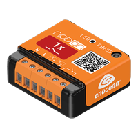 | **SIN-2-1-01** | Module Multifonction | Interrupteur |
| 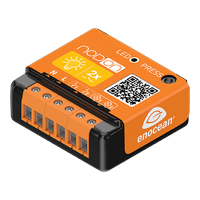 | **SIN-2-2-01** | Module Éclairage ON/OFF 2 canaux | 2 lumières |
| 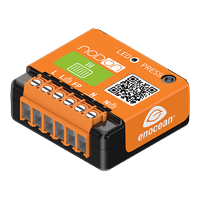 | **SIN-2-FP-01** | Module Chauffage Fil Pilote | Sélecteur de mode (6 ordres) + puissance + énergie |
| 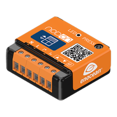 | **SIN-2-RS-01** | Module Volet Roulant | Volet avec position |
| 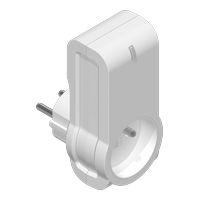 | **ASP-2-1-00 (FR)<br>ASP-2-1-10 (DE)** | Prise intelligente | Prise |
| 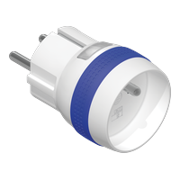 | **MSP-2-1-01 (FR)<br>MSP-2-1-11 (DE)** | Micro Smart Plug + Mesure | Prise + puissance + énergie |
| 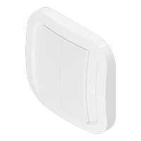 | **CWS-2-1-01** | Interrupteur mural sans pile | Événements par touche (haut/bas, gauche/droite, combinaisons) |
| 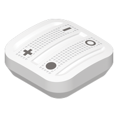 | **CRC-2-6-0x** | Soft Remote | Événements par bouton (4 boutons, combinaisons) |
| 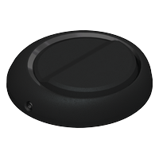 | **CFS-2-1-05** | Interrupteur de sol | Événements appui / relâchement |
| 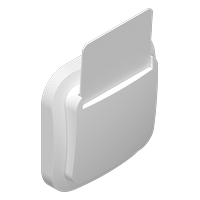 | **CCS-2-1-01** | Interrupteur à carte | Carte insérée (oui / non) |
| 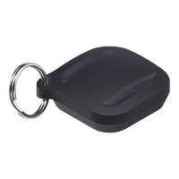 | **TSB-2-2-02** | Soft Button | Événements simple / double / long + batterie |
| 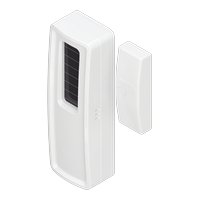 | **SDO-2-1-05** | Détecteur d'ouverture portes et fenêtres | Capteur d'ouverture |
| 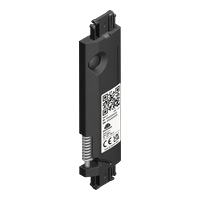 | **SWO-2-1-00** | Capteur d'ouverture invisible sans pile | Capteur d'ouverture |
| 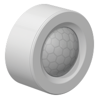 | **PIR-2-1-01** | Détecteur de mouvement | Mouvement + luminosité + tension pile |
|  | **STP-2-1-05** | Capteur de température | Température |
| 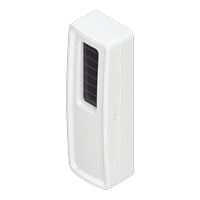 | **STPH-2-1-05** | Capteur de température et d'humidité | Température + humidité |

Chaque produit a en plus un capteur « Signal » (RSSI), désactivé par défaut.

## Aperçu

| 1. Choix du produit | 2. Consigne d'appairage |
|:---:|:---:|
| 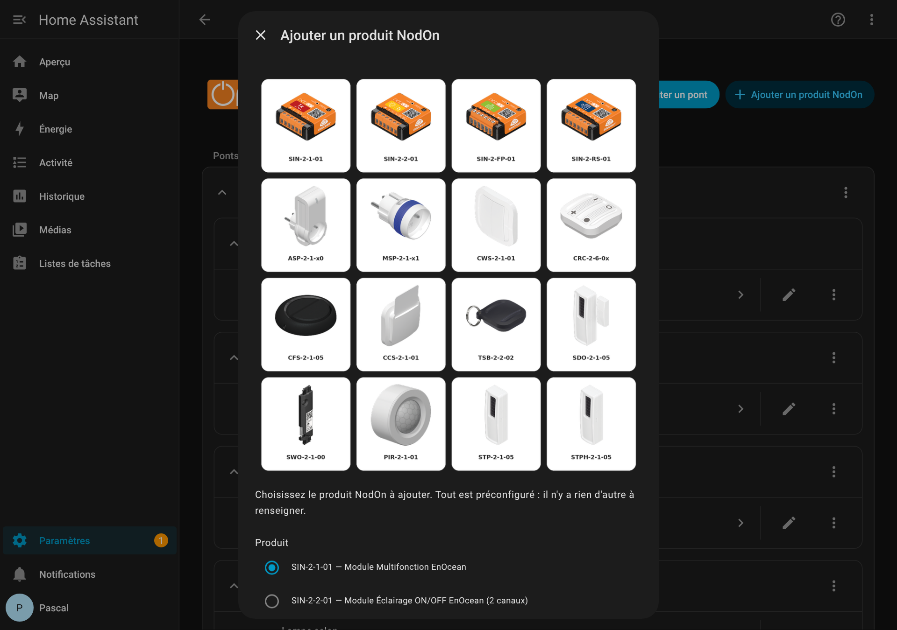 | 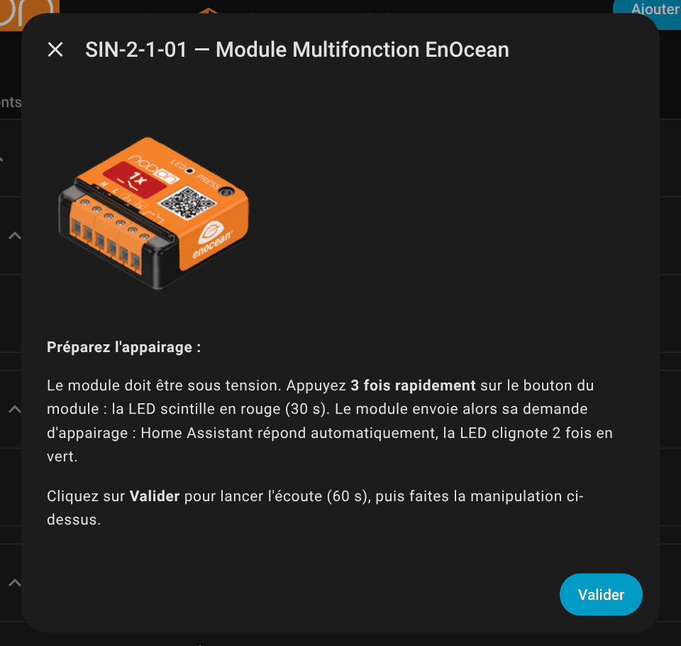 |
| **3. Nom et pièce** | **4. Fiche du produit et réglages** |
| 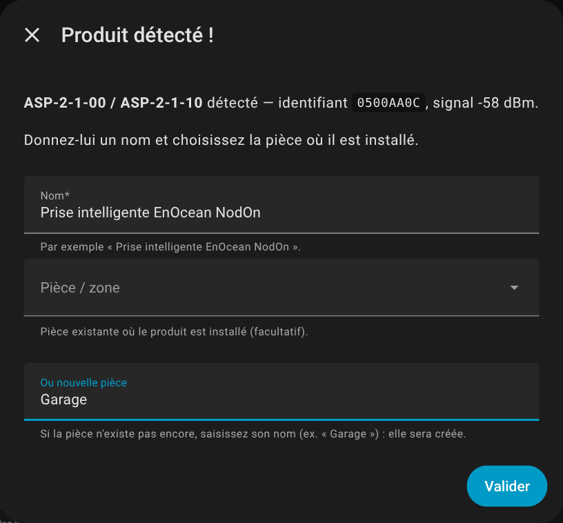 | 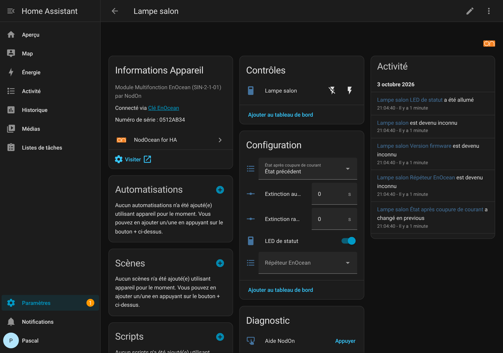 |
| **5. Aide NodOn** | |
| 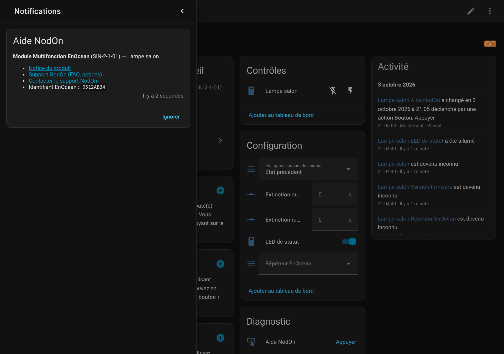 | |

## Prérequis

- Home Assistant **2025.3** ou plus récent (toutes les installations : OS, Container, Core).
- Une clé USB EnOcean **USB300**, ou une clé compatible ESP3 (TCM310, USB500…).
- Pas de broker MQTT, pas d'add-on : l'intégration parle directement à la clé.

> ⚠️ Si l'intégration EnOcean native de Home Assistant utilise déjà la clé, supprimez-la d'abord : une clé ne peut servir qu'à une seule intégration à la fois.

## Installation (HACS)

1. Dans HACS, ouvrez **⋮ → Dépôts personnalisés**, ajoutez `https://github.com/eHomeLabs/NodOcean-for-HA` en catégorie **Intégration**.
2. Installez **NodOcean for HA**, puis redémarrez Home Assistant.
3. **Paramètres → Appareils et services → Ajouter une intégration → NodOcean for HA**. Une clé USB300 branchée est normalement détectée automatiquement.

Installation manuelle : copiez le dossier `custom_components/nodon_enocean` dans le dossier `config/custom_components/` de Home Assistant, puis redémarrez.

## Ajouter un produit NodOn

1. Ouvrez l'intégration **NodOcean for HA** et cliquez sur **Ajouter un produit NodOn**.
2. Choisissez le produit dans la liste.
3. Suivez la consigne affichée (par exemple « appuyez 3 fois rapidement sur le bouton du module »), puis cliquez sur **Valider**.
4. Home Assistant écoute pendant 60 s. Il détecte le produit et répond lui-même à sa demande d'appairage pour les modules et les prises.
5. Donnez un nom au produit et choisissez sa pièce (ou créez-en une, par exemple « Garage ») : c'est terminé.

Pour les capteurs et les interrupteurs, si l'appairage échoue, vous pouvez aussi saisir l'identifiant EnOcean imprimé sur le produit.

### Comment ça marche

- **Modules SIN-2, prises ASP-2 / MSP-2.** Ils envoient une requête *UTE teach-in*, et l'intégration y répond automatiquement. Chaque actionneur reçoit son propre identifiant d'émission : le Base ID de la clé + un décalage de 1 à 127. Les commandes lui sont adressées directement.
- **Capteurs SDO-2 / SWO-2 / PIR-2 / STP-2 / STPH-2.** L'intégration détecte leur télégramme d'apprentissage (bit LRN).
- **Interrupteurs CWS-2-1 / CFS-2, Soft Remote, interrupteur à carte.** Le premier appui (ou la première insertion de carte) reçu pendant l'écoute est retenu.
- **Soft Button.** Il est reconnu grâce à sa requête UTE (5 appuis).
- **Interrogation.** Toutes les 60 s, l'intégration demande aux actionneurs leur état, leur puissance et leur énergie.

## Réglages des produits

Depuis la v0.2, chaque produit a ses réglages dans la carte **Configuration** de sa fiche appareil. Le lien **Visiter** de la fiche ouvre la notice du produit sur support.nodon.fr, et la carte **Diagnostic** affiche son visuel.

| Réglage | Produits | Valeurs |
|---|---|---|
| LED de statut (mode jour / nuit) | SIN-2-1-01, SIN-2-2-01, SIN-2-FP-01, ASP-2, MSP-2 | Allumée / éteinte |
| État après coupure de courant | SIN-2-1-01, SIN-2-2-01, SIN-2-FP-01, ASP-2, MSP-2 | Précédent / allumé / éteint |
| Bouton local | SIN-2-FP-01, ASP-2, MSP-2 | Actif / inactif |
| Détection de coupure secteur | ASP-2, MSP-2 | Active / inactive |
| Extinction automatique | SIN-2-1-01, SIN-2-2-01 (par canal), ASP-2, MSP-2 | 0 à 3600 s (0 = désactivée) |
| Extinction radio retardée | SIN-2-1-01, SIN-2-2-01 (par canal) | 0 à 3600 s |
| Répéteur EnOcean | Tous les modules et prises | Désactivé / niveau 1 / niveau 2 |
| Remise à zéro de l'énergie | MSP-2, SIN-2-FP-01 | Bouton |
| Correction de température / d'humidité | STP-2, STPH-2 | ± 5 °C / ± 20 % |
| Indisponible après | SDO-2, STP-2, STPH-2, PIR-2 | 0 à 1440 min sans message (0 = jamais) |
| Façade | CWS-2-1 | 4 boutons / 2 boutons |
| Aide NodOn | Tous | Bouton (carte Diagnostic) : notice, FAQ et contact du support NodOn |

- Les produits ne permettent pas de relire leurs réglages : Home Assistant affiche la dernière valeur envoyée. Les valeurs par défaut sont celles d'un produit neuf.
- Pour la MSP-2 et le SIN-2-FP-01, l'intégration règle elle-même le rapport automatique des mesures : toutes les 10 min au plus tard, ou dès 5 W / 10 Wh d'écart.
- Les interrupteurs CWS-2-1 et CFS-2, la Soft Remote et le Soft Button proposent des **déclencheurs d'appareil** dans l'éditeur d'automatisations (« Haut gauche appuyé », « Double appui »…).

## Supprimer un produit

Dans la liste des produits de l'intégration, faites **⋮ → Supprimer**. Pensez aussi à effacer l'appairage côté produit si besoin : réinitialisation usine, par exemple un appui de plus de 5 s sur le bouton des modules SIN-2.

## Dépannage

Activez les journaux détaillés dans `configuration.yaml` :

```yaml
logger:
  logs:
    custom_components.nodon_enocean: debug
```

Chaque télégramme reçu est alors journalisé (identifiant, RORG, données, RSSI).

## Développement

```bash
pip install pytest-homeassistant-custom-component pyserial-asyncio-fast
pytest
```

Les tests utilisent un simulateur de clé USB300 (`tests/fake_dongle.py`) et les trames des Quick User Guides NodOn.
La fiche technique de chaque produit (EEP, trames, appairage, sources) est dans [docs/PRODUITS.md](docs/PRODUITS.md).

## Licence

MIT. Projet indépendant : il n'est ni affilié à Home Assistant / Nabu Casa, ni approuvé par eux.

---

## English

**NodOcean for HA** is an unofficial Home Assistant integration for **NodOn EnOcean** products. Pick your product from a list: Home Assistant handles the EEP profile, the device ID and the pairing response for you.

**Requirements:** Home Assistant 2025.3 or newer and an EnOcean USB300 (or ESP3-compatible) stick. No MQTT needed.

**Install:** add this repository to HACS as a custom repository (category *Integration*), install **NodOcean for HA**, restart, then add the integration from *Settings → Devices & services*.

**Add a product:** open the integration, click **Add a NodOn product**, choose the model, follow the on-screen pairing instructions and give it a name.

Supported: SIN-2-1-01, SIN-2-2-01, SIN-2-FP-01, SIN-2-RS-01, ASP-2, MSP-2, CWS-2-1, CRC-2, CFS-2, CCS-2, TSB-2, SDO-2, SWO-2, PIR-2, STP-2, STPH-2.
